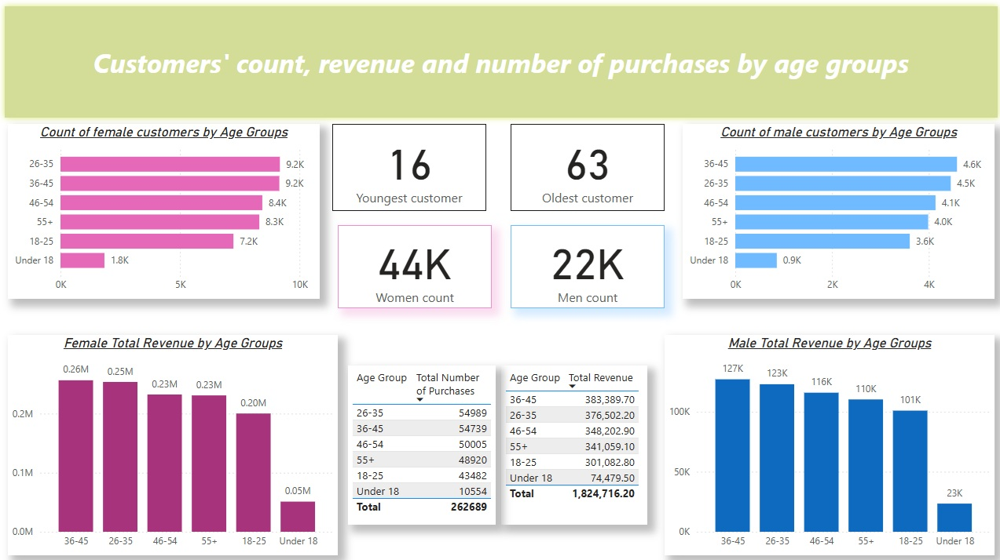
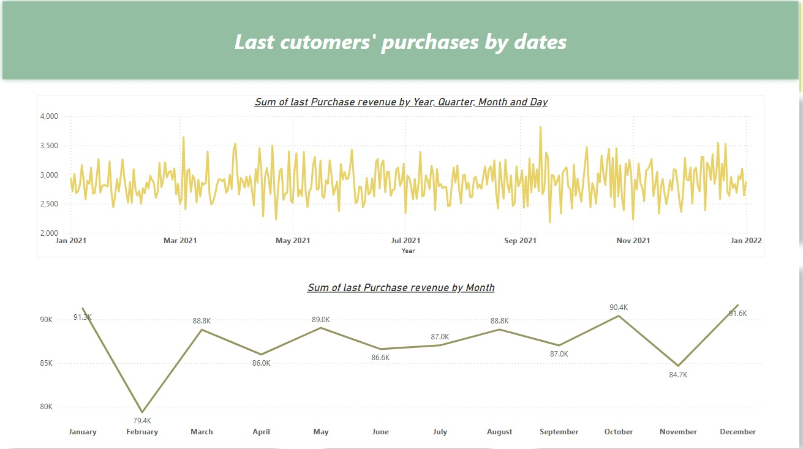
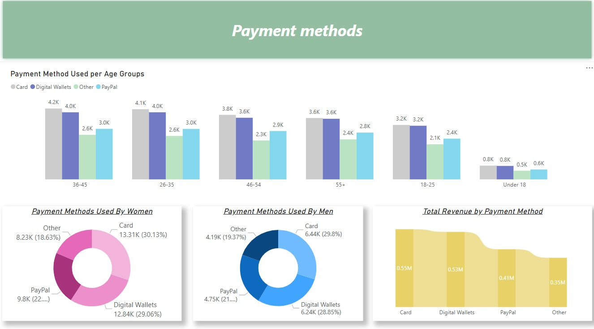
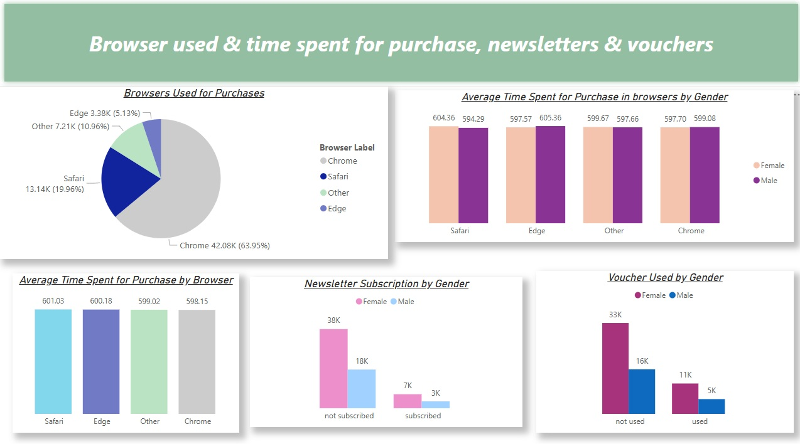

# Retail Dataset Analysis

Initially, several queries were created to familiarize myself with the dataset in Microsoft SQL Server.

This project presents a Power BI dashboard for analyzing the [Retail dataset](https://www.kaggle.com/datasets/onlineretailshop/online-shop-customer-sales-data) from Kaggle. 
---

## Project Overview

- **Goal**: Analyze the Retail Dataset using SQL and visuals.
- **Tools Used**:
  - Microsoft Power BI, DAX 
  - Microsoft SQL Server
  
---

## [Data Source](https://www.kaggle.com/datasets/onlineretailshop/online-shop-customer-sales-data)

The dataset contains the following columns:

- Customer_id = unique customer id
- Age = customer's age
- Gender = 0: Male, 1: Female
- Revenue_Total = total sales by customer
- N_Purchases = number of purchases to date
- Purchase_DATE = date latest purchase, dd.mm.yy
- Purchase_VALUE = latest purchase in €
- Pay_Method = 0: Digital Wallets, 1: Card, 2: PayPal, 3: Other
- Time_Spent = time spent (in sec) on website
- Browser = 0: Chrome, 1: Safari, 2: Edge, 3: Other
- Newsletter = 0: not subscribed, 1: subscribed
- Voucher = 0: not used, 1: used

The data is loaded to MSSQL Server from csv file.

---

## Data processing

-  *Choosing the correct types for columns in Power BI*
-  *Finding out if dataset contains NULL values*
---

## Defined tasks for making insights by myself:

- define the boundary values of Customers Age;
- find out the count of customers per Gender;
- create charts for displaying count of customers per Age Group and Gender;
- represent the Total Revenue and Total Number of Purchases for each Age Group 
- provide visuals for Male and Female Total Revenue by Age Group;
- make charts to illustrate changes in the Last Purchases Revenue over the time;
- analyze Payment Methods by Age Group, Gender;
- depict data about the Total Revenue made using each type of Payment Method;
- provide visuals for the distribution of Used Browsers;
- create stacked bar/column charts for visualization of Time Spent per Purchase in each browser, also investigate an effect of gender;
- represent the data about Newsletter Subscribed customers;
- create visual for Voucher Used count per Gender.


---

## Key Insights:

- The youngest customer is 16 years old, and the oldest is 63. There is a significant prevalence of female customers (~ 2:1). Distributions of female customers by Age Groups are similar to the male customers, with slight differences in hundreds. The Total Revenue is equal to 1,824,716.20, and the Total Number of Purchases is 262 689. The smallest income is from customers Under 18, and the most profitable clients are aged 26 to 45. 

 


-  The peak last Purchase Revenue 3816.90 was observed on September 12, 2021, and the smallest value 2180.39 was on September 17, 2021. 
January and December were the most profitable months, while in February the smallest value of income was noticed. So maybe it depends on the day's amount in February, but it can be a sign to provide some newsletters or other ways to encourage customers to buy products.


 
-  There are four payment methods that customers can use. The most popular method is card, followed by digital wallets and PayPal, while the other methods category is used the least by each Age Group Category.
The donut charts show that there is a similar pattern in chosen Payment methods by women and men. The Total Revenue is relevant to the order of the Used Payment Method percentage.

 

-  Chrome is the most popular Browser for making purchases, which is used by 63.95% of customers. Only 5.13% of clients use the Edge browser.
The visual displaying the Average Time needed for selecting products and making a purchase shows that the smallest value is for Chrome, with a difference of 1-3 seconds for other browsers. For Safari browser, the average time is the largest and equal to 601.03, which can illustrate some drawbacks in the website's productivity or problems with UI/UX.
The chart shows that a very small number of customers are subscribed to the Newsletter, so maybe some sales proposals can provide more enthusiasm to receive news about products.
Compared to a Newsletter subscription, a slightly better picture is displayed for using vouchers.


 


---


## Setup Instructions

### Clone this Repository
```bash
git clone https://github.com/marianaprytula/housing_market_dataset_analysis.git
```

### Load data from csv via 'import flat file' in the Microsoft SQL Server.

### Connect to MSSQL Server database ('Get data from' functionality in Power BI)
